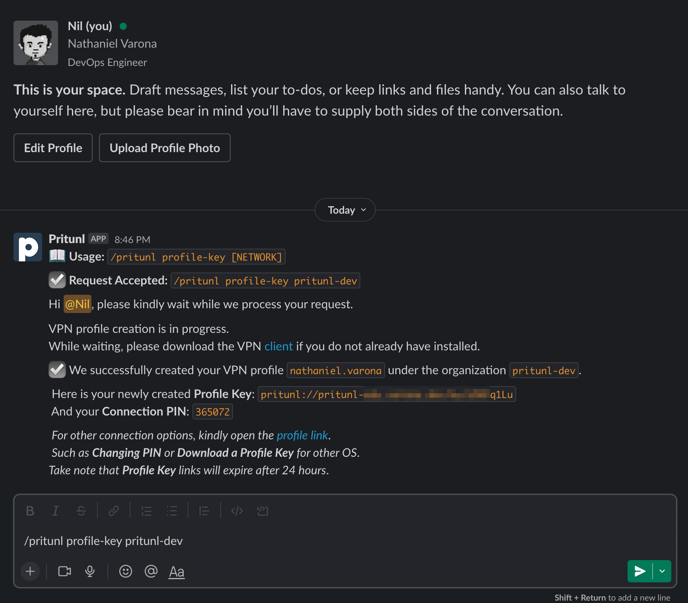

# pritunl-slack-app
Pritunl Slack App Slash Commands

## Pritunl Slack Slash Commands Screenshot



## Installation

```bash
git clone https://github.com/nathanielvarona/pritunl-slack-app.git
cd pritunl-slack-app

poetry install
```

## Flask-Based Environment

## Install the Flask Extras

```bash
poetry install --extras=flask
```

### Development

```bash
poetry run flask run
```

### Production and Deployment

```bash
poetry run gunicorn pritunl_slack_app.flask_handler:flask_app -b 0.0.0.0:9000
```


## AWS Lambda Function

### Export Dependencies to plain `requirements.txt`

```bash
poetry export --without-hashes --format requirements.txt --output ./pritunl_slack_app/function/requirements.txt
```

### SAM Build
```bash
sam build --use-container
```

### SAM Deployment

```bash
sam deploy --guided
```
