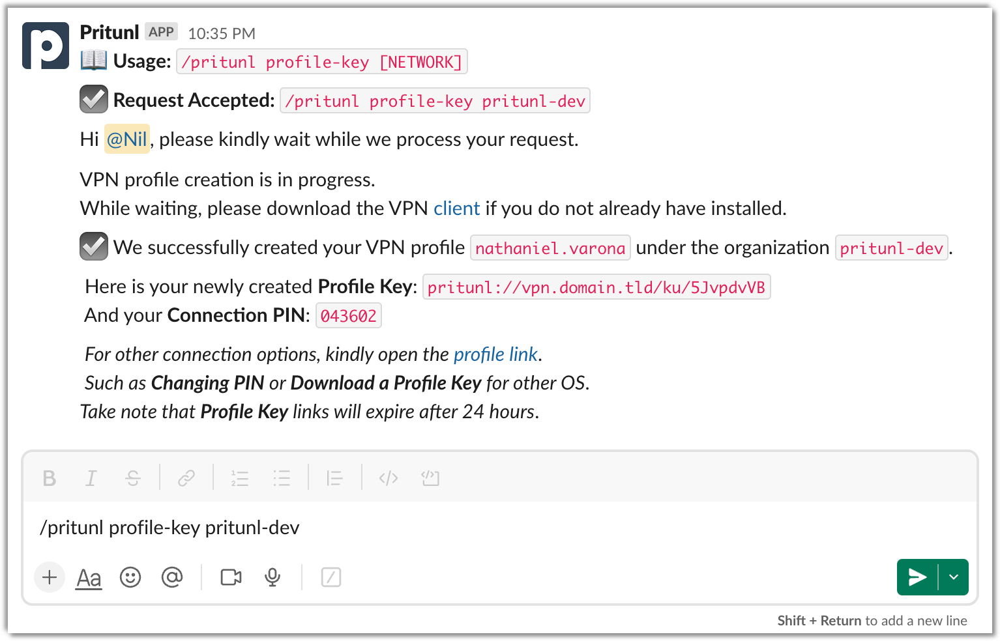

# pritunl-slack-app
Pritunl Slack App Slash Commands

## Pritunl Slack Slash Commands Screenshot

<picture>
  <source media="(prefers-color-scheme: dark)" srcset="./doc/img/example-pritunl-slack-dark.png">
  
</picture>

## Installation

### Flask _(Server)_

#### Install the Flask Extras

Using Poetry

```bash
poetry install --extras=flask
```

Using PIP _(source install)_

```bash
pip install .[flask]
```

#### Development

```bash
flask run
```

#### Production

```bash
gunicorn pritunl_slack_app.flask_handler:flask_app \
 --bind 0.0.0.0:9000
```


### AWS Lambda _(Serverless)_

#### Using `.zip` file archives

##### Export Poetry Dependencies to base PIP `requirements.txt`

```bash
poetry export --without-hashes \
  --format requirements.txt \
  --output ./pritunl_slack_app/function/requirements.txt
```

##### SAM Build
```bash
sam build --use-container
```

##### SAM Deployment

```bash
sam deploy --guided
```

> Check out the article [Build a Pritunl Slack Slash Commands with a Serverless Backend](https://nathanielvarona.github.io/posts/build-a-pritunl-slack-slash-commands-with-a-serverless-backend/) for the complete Serverless Backend deployment.

### Docker Image _(Containers)_

#### Using Flask and Gunicorn App Handlers

##### Production Mode

```bash
docker run -it --rm \
  --env PRITUNL_BASE_URL=https://vpn.domain.tld/ \
  --env PRITUNL_API_SECRET="####" \
  --env PRITUNL_API_TOKEN="####" \
  --env SLACK_SIGNING_SECRET="####" \
  --env SLACK_BOT_TOKEN="####" \
  --env GUNICORN_CMD_ARGS="--timeout 0" \
  --env APP_PORT=8081 \
  --publish 8081:8081 \
  nathanielvarona/pritunl-slack-app
```

##### Other Options

Example 1: Enable AsyncIO Workers by increasing the number of Gunicorn workers and threads.

```bash
docker run -it --rm \
  --env PRITUNL_BASE_URL=https://vpn.domain.tld/ \
  --env PRITUNL_API_SECRET="####" \
  --env PRITUNL_API_TOKEN="####" \
  --env SLACK_SIGNING_SECRET="####" \
  --env SLACK_BOT_TOKEN="####" \
  --env GUNICORN_CMD_ARGS="--timeout 0 --workers 5 --threads 2" \
  --env APP_PORT=8081 \
  --publish 8081:8081 \
  nathanielvarona/pritunl-slack-app
```

Example 2: Enable debug mode.

```bash
docker run -it --rm \
  --env PRITUNL_BASE_URL=https://vpn.domain.tld/ \
  --env PRITUNL_API_SECRET="####" \
  --env PRITUNL_API_TOKEN="####" \
  --env SLACK_SIGNING_SECRET="####" \
  --env SLACK_BOT_TOKEN="####" \
  --env GUNICORN_CMD_ARGS="--timeout 0" \
  --env FLASK_DEBUG=True \
  --env APP_PORT=8081 \
  --publish 8081:8081 \
  nathanielvarona/pritunl-slack-app
```
